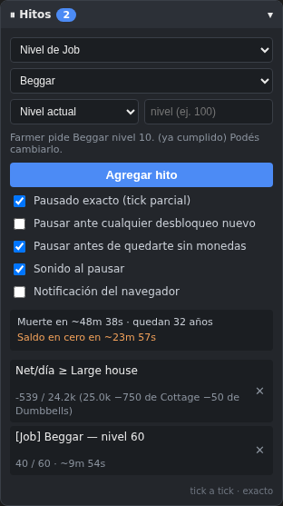

# Progress Knight — Pausa automática por hitos

Userscript que pausa [Progress Knight](https://ihtasham42.github.io/progress-knight/)
automáticamente cuando alcanzás un hito que vos definís mientras jugás: un nivel de job
o de skill, una cantidad de monedas, una edad, un net/día, o cuando podés bancar un
producto del Shop.

Pensado para un idle game que dejás corriendo en una pestaña de fondo: en vez de mirar
cada tanto a ver si llegaste, el juego se frena solo y te avisa.



## Instalación

1. Instalá [Tampermonkey](https://www.tampermonkey.net/) o
   [Violentmonkey](https://violentmonkey.github.io/) en tu navegador.
2. Abrí [`progress-knight-milestone-pause.user.js`](progress-knight-milestone-pause.user.js)
   y hacé clic en **Raw**: el gestor te muestra la pantalla de instalación.
3. Entrá al juego. Aparece un panel **⏸ Hitos** abajo a la derecha.

El script declara `@updateURL`, así que Tampermonkey busca versiones nuevas solo.

## Tipos de hito

| Tipo | Pausa cuando… |
|---|---|
| **Nivel de Job** | el job llega al nivel indicado. Precarga 10, que es lo que pide el job siguiente |
| **Nivel de Skill** | la skill llega al nivel indicado. Precarga el primer requisito pendiente que la use |
| **Monedas** | tus monedas alcanzan el valor |
| **Edad (años)** | cumplís esa edad |
| **Evil** | el evil alcanza el valor |
| **Net/día ≥ cantidad** | ingreso menos gastos por día alcanza el valor (acepta negativos) |
| **Net/día ≥ producto del Shop** | podés bancar ese producto |
| **Desbloqueo puntual** | ese job, skill o item queda desbloqueado |

Los valores aceptan `1000000`, `1M`, `2.5k` o `1e6`. Cada fila muestra el progreso y un
ETA estimado; si el hito es de una tarea que no estás haciendo, el ETA dice
*"si la activás"*, porque es una proyección con su xp/día actual y no una cuenta regresiva.

### Qué propone al cumplir un hito

Cuando se cumple un hito de skill, el panel deja precargado el siguiente: la skill con el
menor nivel pendiente **entre los requisitos que el juego te está mostrando**. El juego pinta,
por cada categoría, una sola fila de requisitos —la del primer elemento todavía no
completado—, así que un requisito más chico pedido por algo que aún no aparece en pantalla
(*"Merchant pide Bargaining 50"* cuando ni Farmer desbloqueaste) no cuenta. La skill en sí
puede estar bloqueada: lo que importa es que algo visible la esté pidiendo.

### Costo real en el Shop

`gameData.currentProperty` es una sola: comprar una property reemplaza a la anterior, y el
net/día ya viene con el gasto de la actual descontado. Por eso el umbral de una Property es
la **diferencia** contra la que tenés puesta — con una Cottage, "Large house" pide 24,3k y no
25k — que es lo mismo que pedir que el net **después** de comprarla siga siendo positivo.
Los Misc, que se acumulan, van al precio entero, y a cero si ya los tenés.

El margen opcional multiplica el umbral: `1` es justo, `1.5` deja 50% de colchón.

## Pausado exacto

Un tick del juego, con time warping alto, puede valer varios niveles. Chequear el estado
cada tanto y pausar después del hecho te deja pasado de largo. El script hace dos cosas:

1. **Se engancha al tick real.** `update()` llama por nombre a `increaseDays()` y a
   `updateUI()`, y las *function declarations* sí son propiedades de `window` (a diferencia
   de los `const`), así que reemplazándolas se consiguen un hook pre-tick y otro post-tick.
2. **Escala el último tick.** Todo lo que avanza en un tick —xp, monedas, gastos, días—
   pasa por `applySpeed()`. Envolviéndola con un factor `f ∈ (0,1)` se obtiene literalmente
   medio tick, consistente entre todas las magnitudes. Antes de cada tick se calcula cuánto
   falta y cuánto rinde el tick; si el hito cae dentro del próximo, se escala ese único tick
   para aterrizar justo en el umbral.

Medido sobre el juego corriendo, mismo escenario con y sin la segunda capa:

| Hito | Sin tick parcial | Con tick parcial |
|---|---|---|
| Concentration nivel 20 | nivel 23 | nivel 20, xp 0.000 |
| 1.000.000 monedas | 1.000.002 | 1.000.000,0001 |
| Edad 20 años | 8111 días (22,2 años) | 7300,000 días exactos |

Para lo que no crece de forma continua —net/día, evil, desbloqueos, nivel máximo— el cruce
ocurre en un instante discreto, así que el chequeo por tick ya es exacto y no hace falta
escalar nada. Se puede apagar con **Pausado exacto (tick parcial)**; el hook al tick sigue
funcionando igual.

## Opciones

- **Pausar ante cualquier desbloqueo nuevo** — avisa en cada paso de bloqueado a
  desbloqueado. Después de renacer, lo que recuperás cuenta como nuevo: `rebirthReset()`
  re-bloquea todo salvo `permanentUnlocks`. El instante del renacer no dispara nada.
  - **ignorar los ya vistos en vidas anteriores** — filtra la recuperación post-rebirth
    contra una lista de todo lo desbloqueado alguna vez.
- **Sonido al pausar** y **Notificación del navegador**. Con la pestaña en segundo plano el
  título parpadea hasta que volvés.

Los hitos y la configuración viven en `localStorage`, en su propia clave (`pkHitos_v1`),
separada del save del juego. El Reset del propio juego hace `localStorage.clear()` y también
se los lleva.

## Pruebas

93 pruebas end-to-end con Playwright sobre una copia local del juego: precisión del tick
parcial, umbrales del Shop, desbloqueos a través del rebirth, y comportamiento de la UI.

```bash
pip install playwright && playwright install chromium
cd tests && python3 test_precision.py       # una suite
for f in test_*.py; do python3 "$f"; done   # todas
```

La primera corrida clona el juego en `.game/`. Detalles en [`tests/README.md`](tests/README.md).

## Notas sobre el juego

Dos cosas que confunden al leer el código de Progress Knight y que este script tiene en cuenta:

- `getGameSpeed()` devuelve días por **segundo**, no por tick: para el tick hay que dividir
  por `updateSpeed`.
- El efecto del Time warping no es lineal sino `1 + log₁₃(nivel+1)`, definido en
  `setCustomEffects()`. Ni con nivel un millón pasás de x6,4.
- Las tablas de categorías (`jobCategories`, `itemCategories`, …) están declaradas con
  `const`, y un `const` de nivel superior no queda en `window`. Se leen con un eval indirecto,
  con respaldo a una lista plana si alguna CSP lo bloqueara.

## Créditos

El juego es [Progress Knight](https://github.com/ihtasham42/progress-knight) de
**ihtasham42**, publicado bajo Unlicense. Este userscript no lo modifica: lee `gameData` y
escribe `gameData.paused`, lo mismo que hace el botón Pause.

MIT — ver [LICENSE](LICENSE).
